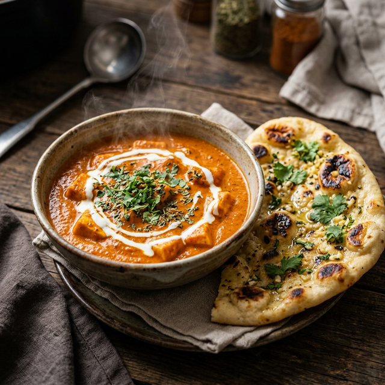

<!DOCTYPE html>
<html lang="en">
<head>
  <meta charset="UTF-8">
  <meta name="viewport" content="width=device-width, initial-scale=1.0">
  <meta name="description" content="Become an iCook Magic Mixx Founding Partner. Get ₹23,000 worth of products for ₹21,000. Exclusive pincode territory. Earn 20-30% commission. FSSAI & bank account setup included.">
  <meta name="keywords" content="iCook Magic, Magic Mixx, founding partner, earn from home, ready to cook, Indian spices, FSSAI, home business, pincode exclusive">
  <title>Become a Founding Partner | iCook Magic Mixx</title>
  <link rel="stylesheet" href="index.css">
  <link rel="icon" type="image/svg+xml" href="data:image/svg+xml,<svg xmlns='http://www.w3.org/2000/svg' viewBox='0 0 100 100'><text y='.9em' font-size='90'>🍛</text></svg>">
</head>
<body>

  <!-- NAVIGATION — Matching icookmagic.com -->
  <nav class="navbar" id="navbar">
    

      <a href="https://icookmagic.com" class="nav-logo">
        
🍛

        iCook Magic
      </a>
      

        <a href="https://icookmagic.com/shop/" class="nav-link">Shop</a>
        <a href="https://icookmagic.com/recipes/" class="nav-link">Recipes</a>
        <a href="https://icookmagic.com/meal-plan" class="nav-link">Meal Plan</a>
        

          <a href="#" class="nav-link nav-dropdown-toggle">Partner Programme ▾</a>
          

            <a href="#partner-program">Overview</a>
            <a href="#problem">Why Magic Mixx?</a>
            <a href="#calculator">Earnings Calculator</a>
            <a href="#how-it-works">How It Works</a>
            <a href="#starter-kit">Founding Partner Kit</a>
            <a href="#requirements">Requirements</a>
            <a href="#faq">FAQ</a>
          

        

        <a href="https://icookmagic.com/blog/" class="nav-link">Blog</a>
        <a href="https://icookmagic.com/video-blogs/" class="nav-link">Watch</a>
        <a href="https://icookmagic.com/contact-us/" class="nav-link">Contact Us</a>
        <a href="#join" class="btn btn-primary nav-cta">Become a Partner</a>
      

      <button class="nav-mobile-toggle" id="navToggle" aria-label="Toggle navigation">
        
      </button>
    

  </nav>

  <!-- HERO BANNER — Light & Trust-Focused -->
  <section class="hero-banner" id="hero">
    

      <!-- LEFT: Direct headline -->
      

        <h1 class="hero-banner-title">
          Join the Magic Founder Partner Network
        </h1>
        
Exclusive pincode rights. Earn up to 30%. Zero‑risk start. 120-day money-back guarantee.

        <a href="#join" class="btn btn-primary hero-cta-btn">Become a Founding Partner →</a>
        

          
🛡️ 120-Day Guarantee

          
📍 1 Per Pincode

          
📦 ₹23K Products

        

      

      

        

          
        

      

    

  </section>

  <!-- PROBLEM SECTION -->
  <section class="problem-section" id="problem">
    

      
The Problem

      <h2 class="section-title animate-on-scroll">Indian Cooking is Beautiful. But <em>Exhausting.</em></h2>
      

        Every Indian meal demands 30-40 minutes of prep before cooking even starts. 
        This is the hidden labor that keeps millions stressed in the kitchen every day.
      

      

        

          
🧅

          <h3>Cutting & Chopping</h3>
          
Onions, tomatoes, ginger, garlic — tears, mess, and time wasted before a single flame is lit.

          15-20 min wasted
        

        

          
🌶️

          <h3>Mixing Masalas</h3>
          
Which masala? How much? Too little = bland. Too much = ruined. A guessing game every meal.

          Trial & error
        

        

          
🍳

          <h3>Roasting & Tempering</h3>
          
Oil splatter, smoke, burning spices. One wrong second and the jeera is burnt, the tadka is gone.

          10-15 min of stress
        

        

          
😔

          <h3>Daily Exhaustion</h3>
          
3 meals × 365 days = 1,095 cooking sessions/year. No wonder cooking feels like a chore, not a joy.

          500+ hours/year
        

      

    

  </section>

  <!-- SOLUTION / PRODUCT SECTION -->
  <section class="solution-section" id="solution">
    

      

        

          
The iCook Magic Difference

          <h2 class="section-title animate-on-scroll" style="color: #fff;">
            Not a masala. A complete <em>cooking system.</em>
          </h2>
          

            iCook Magic Magic Mixx is a pre-roasted, pre-ground blend of 50+ real herbs, 
            condiments, and rock salt. Just add it to boiled vegetables or cereals — 
            authentic Indian taste, guaranteed, every time.
          

          

            Rock Salt
            Turmeric
            Coriander
            Black Pepper
            Cumin
            Fenugreek
            Bay Leaves
            Cardamom
            Cloves
            Cinnamon
            Dried Ginger
            Fennel
            +38 more herbs
          

          <a href="#join" class="btn btn-primary animate-on-scroll">Become a Founding Partner →</a>
        

        

          

            

              
❌ Without Magic Mixx

              
✅ With Magic Mixx

            

            

              

                
🧅 Cut onions, tomatoes

                
⏭️ Skip entirely

              

              

                
🌶️ Mix 8-10 masalas

                
1️⃣ Just one Magic Mixx

              

              

                
🔥 Roast & temper spices

                
✨ Already pre-roasted

              

              

                
🎲 Taste varies each time

                
🎯 Consistent every time

              

            

            

              
⏱ 45-60 min · ₹190-310

              
⏱ 15-20 min · ₹120

            

          

        

      

    

  </section>

  <!-- EARNINGS CALCULATOR SECTION -->
  <section class="opportunity-section" id="calculator">
    

      
Your Earnings

      <h2 class="section-title animate-on-scroll">Calculate How Much <em>You'll Earn.</em></h2>
      

        Select a product, enter how many packs you can sell per month, and see your real earnings 
        — with commission tiers applied automatically.
      

      

        
        <!-- LEFT: Inputs -->
        

          <h3 class="calc-section-title">Configure Your Sales</h3>

          

            <label>Choose Your Product</label>
            

              <button class="product-card" data-price="120">
                ₹120
                Grocery Kits
              </button>
              <button class="product-card active" data-price="480">
                ₹480
                Magic Mixx
              </button>
              <button class="product-card" data-price="960">
                ₹960
                Combo Packs
              </button>
            

            <!-- hidden select for JS compatibility -->
            <select id="product-select" style="display:none;">
              <option value="120">Grocery Kits — ₹120</option>
              <option value="480" selected>Magic Mixx — ₹480</option>
              <option value="960">Combo Packs — ₹960</option>
            </select>
          

          

            <label>Packs Sold Per Month</label>
            

              

                50 packs
              

              <input type="range" id="packs-slider" min="10" max="500" value="50" step="5">
              

                10 packs
                250 packs
                500 packs
              

            

          

          

            <label>Delivery Method</label>
            

              <button class="toggle-btn active" data-delivery="no" id="delivery-no">
                📦
                Company Ships
              </button>
              <button class="toggle-btn" data-delivery="yes" id="delivery-yes">
                🚗
                I Deliver (+10%)
              </button>
            

          

        

        <!-- RIGHT: Results -->
        

          <h3 class="calc-section-title" style="color: var(--brand-primary-light);">Your Monthly Earnings</h3>
          
          <!-- Commission tier indicator -->
          

            

              

              

            

            

              20% <small>Base</small>
              25% <small>₹10K+</small>
              30% <small>₹50K+</small>
            

          

          

            📊 Monthly Sales Value
            ₹12,500
          

          

            💰 Commission (25%)
            ₹3,125
          

          

            🚗 Self-Delivery Bonus (+10%)
            ₹0
          

          

            🎁 Performance Bonus
            ₹500
          

          

            YOUR TAKE-HOME
            ₹3,625
          

          

            📊 You crossed ₹10K sales — <strong>25% commission</strong> applied on ALL sales this month!
          

        

      

      <!-- Commission Tiers Reference -->
      

        

          
📊

          <h3>Base Commission</h3>
          
20%

          
On all sales up to ₹10,000/month. Your guaranteed floor rate from Day 1.

        

        

          
🔥

          <h3>Cross ₹10K/month</h3>
          
25%

          
+5% bonus kicks in on ALL sales that month — applied retroactively to every rupee!

        

        

          
💎

          <h3>Cross ₹50K/month</h3>
          
30%

          
Power partner rate! +10% on ALL sales. Plus ₹10,000 monthly performance bonus.

        

      

    

  </section>

  <!-- HOW IT WORKS -->
  <section class="steps-section" id="how-it-works">
    

      
Getting Started

      <h2 class="section-title animate-on-scroll">Five Steps to <em>Become a Founding Partner.</em></h2>

      

        

          
1

          <h3>Register & Check Pincode</h3>
          
Fill the form, select your pincode. If available, it's exclusively yours for 12 months.

        

        

          
2

          <h3>Pay ₹21,000</h3>
          
One-time investment. Get ₹23,000 worth of products — ₹21K for selling + ₹2K for self-use & demos.

        

        

          
3

          <h3>FSSAI + Bank Setup</h3>
          
We handle your FSSAI licence (24-48 hrs) and help open your zero-balance Axis ASAP business account.

        

        

          
4

          <h3>Training & Launch</h3>
          
Access video training, WhatsApp templates, recipe cards. Join the partner community. Start selling.

        

        

          
5

          <h3>Earn & Grow</h3>
          
Receive company-routed orders + sell to your network. Weekly payouts. Climb to 25-30% commission.

        

      

    

  </section>

  <!-- FOUNDING PARTNER KIT SECTION -->
  <section class="kit-section" id="starter-kit">
    

      

        

          
Founding Partner Kit

          <h2 class="section-title animate-on-scroll" style="color: var(--gray-900);">
            ₹23,000 in products. <em>You pay just ₹21,000.</em>
          </h2>
          

            Unlike franchises that charge ₹5-10 Lakh, we give you MORE product value than your investment. 
            Plus FSSAI, bank account, and training — all included. Only 1,000 slots. 1 per pincode.
          

          

            
<s>Membership Cost: ₹50,000</s>

            
₹21,000

            
📍 Exclusive Pincode Territory — 12 Months

            
* Founding Partner pricing valid till 1,000 partners or 1st August 2026. Post that, partner fee will be revised to ₹50,000.

          

          <a href="#join" class="btn btn-primary animate-on-scroll">Claim Your Pincode →</a>

          

            
🛡️

            

              <h4>120-Day Money-Back Guarantee</h4>
              
Return unsold stock within 120 days for a full refund (minus consumed products & setup costs). Zero risk.

            

          

        

        

          

            <h3>📦 What You Get for ₹21,000</h3>
            

              

                
🍛

                

                  <h4>₹21,000 Worth of Magic Mixxs</h4>
                  
Full product inventory ready to sell from Day 1

                

              

              

                
🎁

                

                  <h4>₹2,000 Bonus Products (Free)</h4>
                  
For your own cooking & neighborhood demos

                

              

              

                
📋

                

                  <h4>FSSAI Basic Registration</h4>
                  
We handle the entire process — licence in 24-48 hrs

                

              

              

                
🏦

                

                  <h4>Business Bank Account Setup</h4>
                  
Axis ASAP zero-balance account — for payouts & future GST

                

              

              

                
🪪

                

                  <h4>PAN Card Assistance (If Needed)</h4>
                  
We help you apply — cost included in the fee

                

              

              

                
🎓

                

                  <h4>Training + WhatsApp Community</h4>
                  
Video training, sales templates, recipe cards & 24/7 support

                

              

            

          

        

      

    

  </section>

  <!-- REQUIREMENTS SECTION -->
  <section class="problem-section" id="requirements" style="background: var(--white);">
    

      
What You Need

      <h2 class="section-title animate-on-scroll">Simple Requirements. <em>We Handle the Hard Parts.</em></h2>
      

        All you need is Aadhaar + a smartphone + ₹21,000. We take care of FSSAI, bank account, PAN card, and training.
      

      

        <!-- Aadhaar Card -->
        

          
🪪

          <h3>Aadhaar Card</h3>
          
The foundation of your business identity. Required for FSSAI applications and bank verification.

          ✓ You provide
        

        <!-- PAN Card -->
        

          
📄

          <h3>PAN Card</h3>
          
Essential for your business bank account. Don't have one? We apply for it on your behalf!

          🤝 We Assist
        

        <!-- FSSAI Licence -->
        

          
📜

          <h3>FSSAI Licence</h3>
          
Mandatory for food businesses. We handle the 100% legal process via our priority API channel.

          🚀 We Handle
        

        <!-- Bank Account -->
        

          
🏦

          <h3>Bank Setup</h3>
          
Zero-balance business account setup. 100% online with Video-KYC assistance from our team.

          ⚡ We Setup
        

      

      <!-- GST Notice -->
      

        
📊

        

          <h4 style="color: var(--brand-accent);">GST Registration — Only When You're Big</h4>
          
GST is only mandatory when your annual turnover crosses ₹40 lakh. 
            When you hit this milestone, we help you register for GST and upgrade to an HDFC InstaBiz current account. 
            That's a sign of a power partner — celebrate it!

        

      

    

  </section>

  <!-- TESTIMONIALS / SOCIAL PROOF -->
  <section class="testimonials-section" id="testimonials">
    

      
Why Join as a Founding Partner?

      <h2 class="section-title animate-on-scroll">What Makes This <em>Different.</em></h2>

      

        

          
📍 Exclusive

          
"

          

            <strong>1 Partner Per Pincode.</strong> No local competition. Every order in your area comes to you. 
            It's like owning a franchise territory — but for ₹21,000 instead of ₹10 lakh.
          

          

            
🏘️

            

              <h4>Pincode Exclusivity</h4>
              
Locked for 12 months

            

          

        

        

          
🛡️ Zero Risk

          
"

          

            <strong>90-Day Money-Back Guarantee.</strong> If it doesn't work out, return unsold stock — 
            we refund your money. You literally have nothing to lose except the products you've already consumed.
          

          

            
💰

            

              <h4>Full Refund Policy</h4>
              
On unsold stock within 90 days

            

          

        

        

          
📱 We Bring Orders

          
"

          

            <strong>We run ads. You fulfil orders.</strong> iCook Magic runs Instagram, Facebook & Google campaigns. 
            Orders from your pincode are routed directly to you. Plus earn more from your own network.
          

          

            
📦

            

              <h4>Orders Come to You</h4>
              
Company-funded marketing

            

          

        

      

    

  </section>

  <!-- FAQ SECTION -->
  <section class="faq-section" id="faq">
    

      
Common Questions

      <h2 class="section-title animate-on-scroll">Everything You Need to Know</h2>

      

        

          <button class="faq-question" aria-expanded="true">
            What exactly is a Magic Mixx? Is it a masala?
            +
          </button>
          

            

              No! Magic Mixx is not a masala. "Rasa" means essence in Sanskrit. It's a complete cooking system — 
              a pre-roasted, pre-ground blend of 50+ real herbs, condiments, and rock salt that 
              <strong>replaces your entire prep process</strong>. Regular masalas only add flavor — you still 
              need to cut onions, grind spices, and temper. With Magic Mixx, you just add it to boiled 
              vegetables or cereals and you're done. Authentic taste, half the time.
            

          

        

        

          <button class="faq-question" aria-expanded="false">
            Why do I need to pay ₹21,000? Is this an MLM?
            +
          </button>
          

            

              <strong>Absolutely not an MLM.</strong> You're paying ₹21,000 for ₹23,000 worth of actual products to sell — 
              you get MORE than you pay. This includes ₹21K selling stock + ₹2K for self-use, FSSAI licence, bank account 
              setup, and training. There are no levels, no downlines. You earn from product sales only. Plus, you have a 
              <strong>120-day money-back guarantee</strong> — return unsold stock for a full refund.
            

          

        

        

          <button class="faq-question" aria-expanded="false">
            What is FSSAI and why do I need it?
            +
          </button>
          

            

              FSSAI (Food Safety and Standards Authority of India) registration is mandatory by law for anyone selling 
              food products. We apply for your <strong>FSSAI Basic Registration (Form A)</strong> — it's for businesses 
              with turnover under ₹12 lakh/year. The total cost is ~₹900 (₹100 govt fee + agent processing) and is 
              <strong>fully absorbed within your ₹21,000 fee</strong>. We handle the entire process via automated API — 
              your licence arrives in 24-48 hours.
            

          

        

        

          <button class="faq-question" aria-expanded="false">
            Do I need a PAN Card? What if I don't have one?
            +
          </button>
          

            

              <strong>Yes, PAN card is mandatory</strong> for opening a bank account and FSSAI registration. 
              If you don't have one, you can get a <strong>free instant e-PAN</strong> from the Income Tax e-filing 
              portal (just need Aadhaar linked to mobile). If you need a physical PAN card, the cost is ₹107 — 
              we help you apply and the cost is absorbed within your ₹21,000 fee.
            

          

        

        

          <button class="faq-question" aria-expanded="false">
            What bank account do I need?
            +
          </button>
          

            

              We help you open an <strong>Axis ASAP zero-balance savings account</strong> — it's 100% online, 
              requires only Aadhaar + PAN + Video KYC, and has no monthly charges. This is used for commission payouts. 
              When your turnover crosses ₹40 lakh/year, we'll help you upgrade to an <strong>HDFC InstaBiz current 
              account</strong> for GST compliance.
            

          

        

        

          <button class="faq-question" aria-expanded="false">
            When do I need to register for GST?
            +
          </button>
          

            

              <strong>Not at the start!</strong> GST registration is mandatory only when your annual turnover crosses 
              ₹40 lakh (for goods). Most partners will not need GST initially. When you approach this milestone, 
              we alert you and assist with GST registration. This is actually a cause for celebration — it means 
              you're earning over ₹3.3L per month!
            

          

        

        

          <button class="faq-question" aria-expanded="false">
            What does "1 partner per pincode" mean?
            +
          </button>
          

            

              We guarantee that only <strong>ONE Founding Partner</strong> operates in each pincode area. This means 
              zero local competition — all company-routed orders in your pincode come exclusively to you. Your pincode 
              is locked for 12 months (renewable if you maintain ₹5,000/month average sales). India has ~19,000 
              deliverable pincodes, and we're opening only 1,000 in Phase 1 — so register before someone else claims yours!
            

          

        

        

          <button class="faq-question" aria-expanded="false">
            How do commission tiers work?
            +
          </button>
          

            

              You start at <strong>20% commission</strong>. When your monthly sales cross ₹10,000, you unlock 
              <strong>25%</strong> — and it applies retroactively to ALL sales that month. Cross ₹50,000 and 
              you earn <strong>30%</strong> on everything. Plus, if you deliver orders yourself, you get an 
              extra <strong>+10% self-delivery bonus</strong>. There are also monthly cash bonuses up to 
              ₹10,000 for top performers.
            

          

        

      

    

  </section>

  <!-- CTA FOOTER SECTION -->
  <section class="cta-section" id="join">
    

      <h2 class="cta-title animate-on-scroll">Ready to Become a Founding Partner?</h2>
      

        Only 1,000 slots. 1 per pincode. ₹23,000 in products for ₹21,000. 
        FSSAI + bank account included. 120-day money-back guarantee.
      

      

        <a href="https://wa.me/919XXXXXXXXX?text=Hi!%20I%20want%20to%20become%20a%20Magic%20Mixx%20Founding%20Partner.%20Please%20check%20my%20pincode%20availability." 
           class="btn btn-dark" target="_blank" id="whatsapp-cta">
          💬
          Apply via WhatsApp
        </a>
        <a href="mailto:partners@icookmagic.com" class="btn btn-outline">
          ✉️
          Email Us
        </a>
      

      

        
🛡️ 120-Day Money-Back

        
📍 1 Per Pincode

        
📋 FSSAI Included

        
🏦 Bank Account Setup

      

    

  </section>

  <!-- FOOTER -->
  <footer class="footer">
    

      

        <a href="https://icookmagic.com" target="_blank">Main Website</a>
        <a href="#">Privacy Policy</a>
        <a href="#">Terms & Conditions</a>
        <a href="mailto:partners@icookmagic.com">partners@icookmagic.com</a>
      

      
© 2026 iCook Magic. All rights reserved. Not a masala. A Magic Mixx.

      
* Founding Partner fee of ₹21,000 is a limited-period launch offer valid for the first 1,000 partners or until 1st August 2026, whichever is earlier. Post this period, the standard Partner fee will be ₹50,000.

    

  </footer>

  
</body>
</html>

